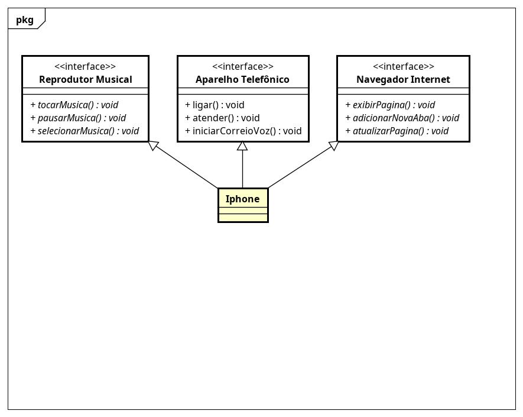

# Diagramação de classe
Desafio realizado como parte integrante do Bootcamp Santander realizado pela Digital Innovation One (DIO).

## Escopo do desafio
Modelagem e diagramação da representação em UML e Código no que se refere ao componente iPhone.

Com base no vídeo de lançamento do iPhone conforme link abaixo, elabore em uma ferramenta de UML de sua preferência a diagramação das classes e interfaces com a proposta de representar os papéis do iPhone de: Reprodutor Musicial, Aparelho Telefônico e Navegador na Internet. Em seguida crie as classes e interfaces no formato de arquivos .java

[Lançamento iPhone 2007](https://www.youtube.com/watch?v=9ou608QQRq8)

Minutos relevantes do 00:15 até 00:55

Comportamentos esperados:
- Reprodutor Musicial: tocar, pausar, selecionarMusica
- Aparelho Telefônico: ligar, atender, iniciarCorrerioVoz
- Navegador na Internet: exibirPagina, adicionarNovaAba, atualizarPagina

## Diagrama des classes e interfaces

